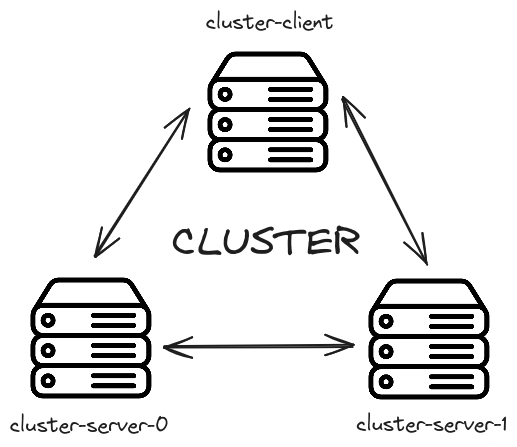

# cloud-cluster

> Cluster setup with Ansible

This Ansible playbook does almost the entire configuration setup for the cluster.

### Requirements

* A local SSH config file configured to access to all nodes of the cluster (passwordless login from **YOUR LOCAL MACHINE**).
* `Python >= 3.10` with `pip`.
* `ansible >= 9.0` installed via `pip`.
* All remote machines must be Debian-based.

Although the steps in this playbook are very general to Debian-based systems, it was only tested on Debian 12 and Ubuntu 22.04.

### Considerations

For this to work correctly, the only thing you need to do is create all virtual machines with the **SAME** key-pair. The public key goes inside the nodes and the private key goes inside the folder `roles/access/files`.
